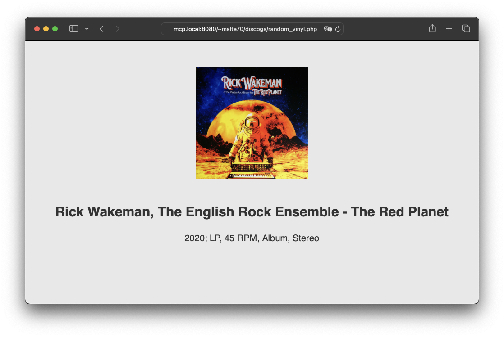

# Discogs Random Vinyl

Get a random item in *Vinyl* format from your Discogs collection.

## Screenshot

## Install

1. Generate a personal access token for the Discogs API [on the developers settings page](https://www.discogs.com/de/settings/developers)
2. Install dependencies using Composer:
  `composer update`
3. Copy `config.inc-dist.php` to `config.inc.php` and modify it:
  - Change the access token to the one you just got
  - Set your Discogs user name
4. Make `cache/` writable by the web server/PHP
  - Avoid `chmod 777`; try changing the group to the one running PHP, like `http` or `www-data`, and `chmod 775`!
5. Done!

## Links

- [calliostro/php-discogs-api: PHP 7.3 / PHP 8.x Implementation of the Discogs API](https://github.com/calliostro/php-discogs-api)

